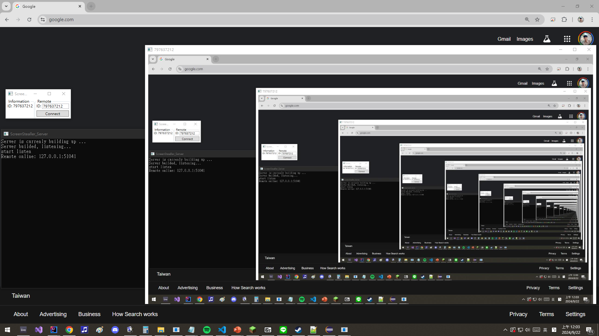

## Whisper
###### First of all... students asked me to name the project "ScreenStealler," but the project isn't really a "stealer" that steals screenshots from others; it works like "TeamViewer": you enter others' ID to control their computer.

###### Just to clarify, in case anyone misunderstands and thinks the project is a hacking tool :p

###### (And I have found out that "Stealler" is not a correct word; I'll fix that in the whole project in the future.)

## Introduction
I'll finish this part in the future...

## Result Screenshot

## Author's Note

This project is open-sourced to provide a resource for those interested in developing a remote control software.

The project is licensed under the MIT License, allowing for commercial use. However, please note that this project was developed as part of a learn-by-doing teaching approach, prioritizing simplicity and ease of understanding in the communication protocols. Encryption and other advanced security measures are **NOT** included in this project. If you intend to use this project for commercial purposes, please ensure the security and confidentiality of the communication by modifying the code accordingly.

## Author Information
- **Author**: Feng-Hao, Yeh
- **Email**:
  - Recommended: zzz3x2c1@gmail.com
  - Alternate: yeh.feng.hao.110@gmail.com
  - Work: yeh.feng.hao@try-n-go.com
